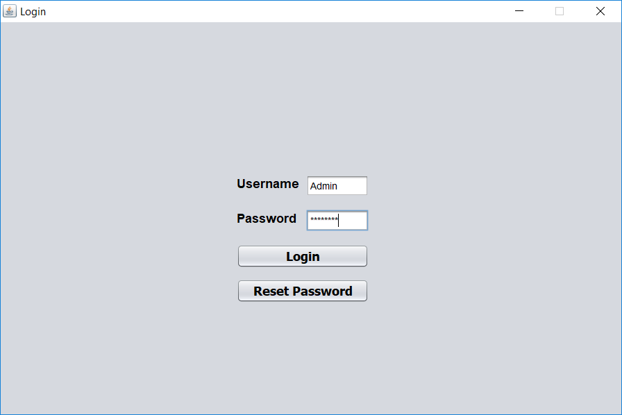
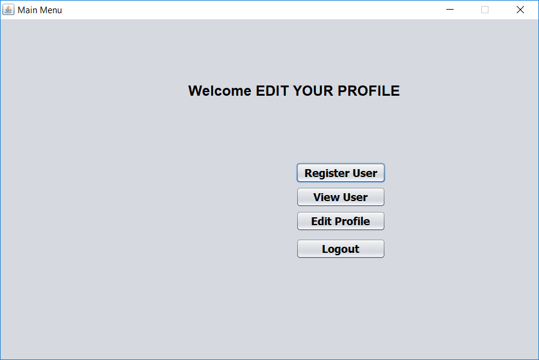
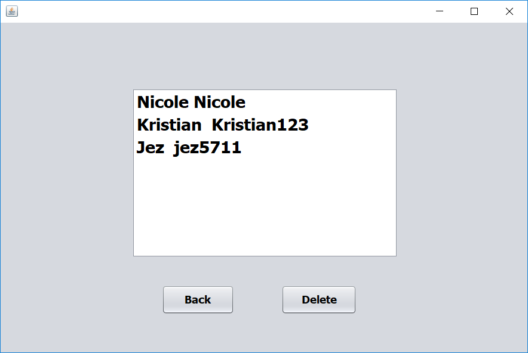
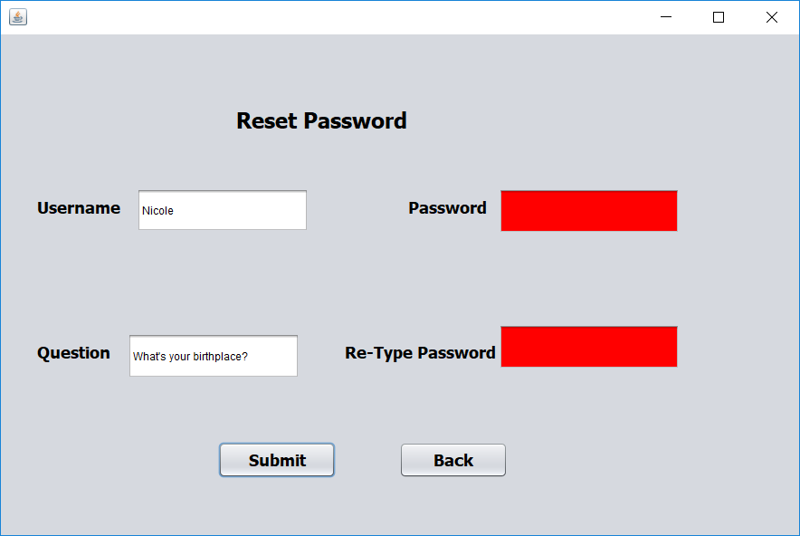
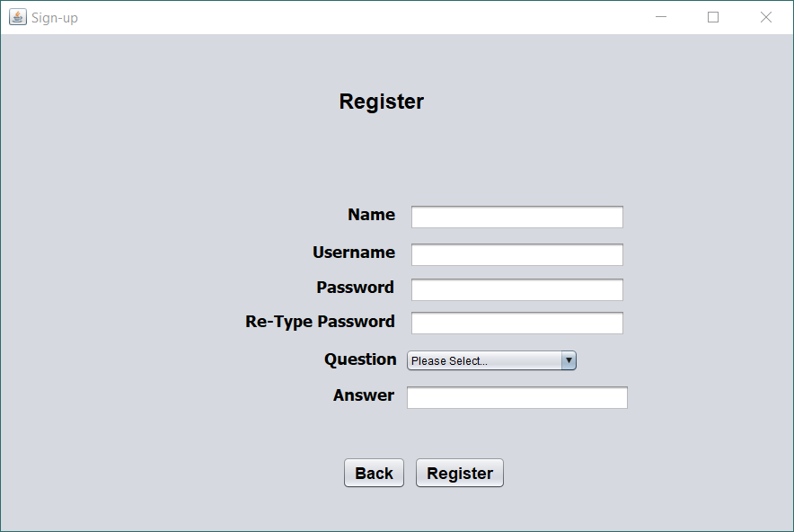

# UserAuth

This is an authentication program which stores users

## The application includes the following security features

* Tripple DES
* HMAC SHA 256
* BCRYPT
* Cipher Block Chaining (CBC)
* Initialization Vector (IV)
* PKCS5Padding

## Screenshots

the initial login is universal
username - admin
password Admin123

before fully using the program, please change your credentials so you can secure the app

the admin can view all existing users

any user can reset their password by entering their username and secret answer

the admin can register new users to the system
