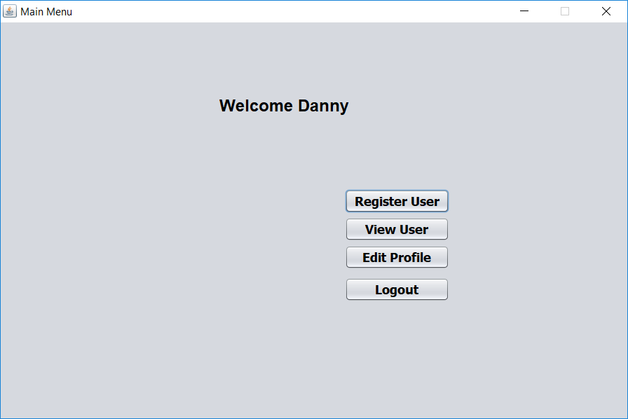

# UserAuth

This is an authentication program which stores users

## The application includes the following security features

* Tripple DES
* HMAC SHA 256
* BCRYPT
* Cipher Block Chaining (CBC)
* Initialization Vector (IV)
* PKCS5Padding

## Screenshots

<pre>the initial login is universal
username - admin
password Admin123</pre>

<pre>before fully using the program, 
please change your credentials so you can secure the app</pre>

<pre>the admin can view all existing users</pre>

<pre>any user can reset their password by entering their username and secret answer</pre>

<pre>the admin can register new users to the system</pre>
